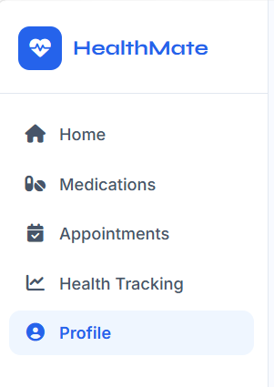
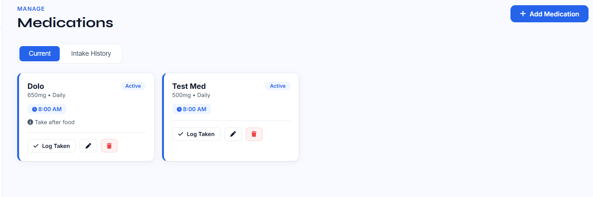
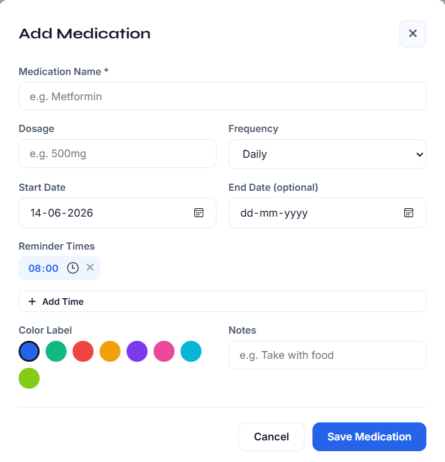

# HealthMate — Medicine Reminder & Health Tracking System

A full-stack healthcare management web application for tracking medications, appointments, and personal health vitals.

**Live Demo:** https://healthmate-0z8i.onrender.com

> Hosted on Render free tier — may take 30 seconds to load if the server is inactive.

---

## Table of Contents

- [About](#about)
- [Features](#features)
- [Tech Stack](#tech-stack)
- [Project Structure](#project-structure)
- [Getting Started](#getting-started)
- [API Endpoints](#api-endpoints)
- [Screenshots](#screenshots)
- [Database Schema](#database-schema)

---

## About

HealthMate is a personal healthcare management platform that helps users stay on top of their medications, track doctor appointments, and monitor daily health vitals — all in one place. Built as a full-stack project using Python (Flask) on the backend and vanilla HTML/CSS/JavaScript on the frontend, with a RESTful API connecting the two.

---

## Features

**Medication Management**
- Add medications with name, dosage, frequency, and color label
- Set multiple daily reminder times per medication
- Mark doses as taken, skipped, or missed
- View full intake history log

**Appointment Tracking**
- Schedule doctor appointments with doctor name, location, date and time
- Separate views for upcoming and past appointments
- Mark appointments as completed

**Health Vitals Tracking**
- Log daily vitals: blood pressure, weight, heart rate, blood sugar, temperature
- Track lifestyle metrics: steps, sleep hours, water intake, mood
- Live charts for BP trend, weight trend, daily steps, sleep hours
- Quick log from the home dashboard

**Smart Reminders**
- Browser push notifications at exact medication times
- Today's medication schedule shown on the home dashboard

**User Profile**
- Store personal info: age, gender, blood type, height
- Record known allergies and medical conditions
- Save emergency contact details

**Responsive Design**
- Works on desktop, tablet, and mobile
- Clean sidebar navigation with mobile hamburger menu

---

## Tech Stack

| Layer | Technology |
|---|---|
| Frontend | HTML5, CSS3, Vanilla JavaScript |
| Backend | Python, Flask |
| Database | SQLite via Flask-SQLAlchemy |
| Charts | Chart.js 4.4 |
| Icons | Font Awesome 6.5 |
| Fonts | Google Fonts (Inter + Syne) |

---

## Project Structure

```
healthmate/
│
├── app.py                  # Flask app — routes, models, API logic
├── requirements.txt        # Python dependencies
├── Procfile                # For deployment on Render
├── runtime.txt             # Python version for Render
│
├── templates/
│   └── index.html          # Single-page frontend
│
├── static/
│   ├── css/
│   │   └── style.css       # Styles and responsive design
│   └── js/
│       └── app.js          # Frontend logic, API calls, charts
│
└── Screenshots/
    ├── HomePage.png
    ├── Dashboard.png
    ├── MedicationPage.png
    ├── AddMedication.png
    ├── Appointment.png
    ├── ScheduleAppointment.png
    └── Profile.png
```

---

## Getting Started

### Prerequisites
- Python 3.11 or higher
- pip

### Installation

1. Clone the repository

```bash
git clone https://github.com/jyotiradithyareddykolan-creator/HealthMate.git
cd HealthMate
```

2. Install dependencies

```bash
pip install -r requirements.txt
```

3. Run the app

```bash
python app.py
```

4. Open in your browser

```
http://localhost:5000
```

The database is created automatically on first run with sample data so the charts and dashboard are not empty.

---

## API Endpoints

### Dashboard
| Method | Endpoint | Description |
|---|---|---|
| GET | `/api/dashboard` | Summary stats for home screen |

### Medications
| Method | Endpoint | Description |
|---|---|---|
| GET | `/api/medications` | Get all medications |
| POST | `/api/medications` | Add a new medication |
| PUT | `/api/medications/<id>` | Update a medication |
| DELETE | `/api/medications/<id>` | Delete a medication |
| POST | `/api/medications/log` | Log a dose (taken/skipped/missed) |
| GET | `/api/medications/logs` | Get full dose intake history |

### Appointments
| Method | Endpoint | Description |
|---|---|---|
| GET | `/api/appointments` | Get all appointments |
| POST | `/api/appointments` | Add a new appointment |
| PUT | `/api/appointments/<id>` | Update or complete an appointment |
| DELETE | `/api/appointments/<id>` | Delete an appointment |

### Health Records
| Method | Endpoint | Description |
|---|---|---|
| GET | `/api/health` | Get recent health records |
| POST | `/api/health` | Add a new health record |
| DELETE | `/api/health/<id>` | Delete a health record |

### Profile
| Method | Endpoint | Description |
|---|---|---|
| GET | `/api/profile` | Get user profile |
| PUT | `/api/profile` | Update user profile |

---

## Screenshots

### Home Page


### Dashboard


### Medication Page


### Add Medication


### Schedule Appointment


### Appointments


### Profile


---

## Database Schema

```
Medication
├── id, name, dosage, frequency
├── times (JSON array of HH:MM strings)
├── start_date, end_date
├── color, notes, active

MedicationLog
├── id, medication_id (FK)
├── taken_at, scheduled_time
├── status (taken / skipped / missed)

Appointment
├── id, title, doctor, location
├── date, time, notes
├── reminder, completed

HealthRecord
├── id, record_date
├── weight, systolic, diastolic
├── heart_rate, blood_sugar, temperature
├── steps, sleep_hours, water_glasses, mood

UserProfile
├── id, name, age, gender, blood_type, height
├── allergies, conditions
├── emergency_contact, emergency_phone
```

---

## Author

Jyotiradithya — [GitHub](https://github.com/jyotiradithyareddykolan-creator)

---

*Built as part of a full-stack development portfolio*
