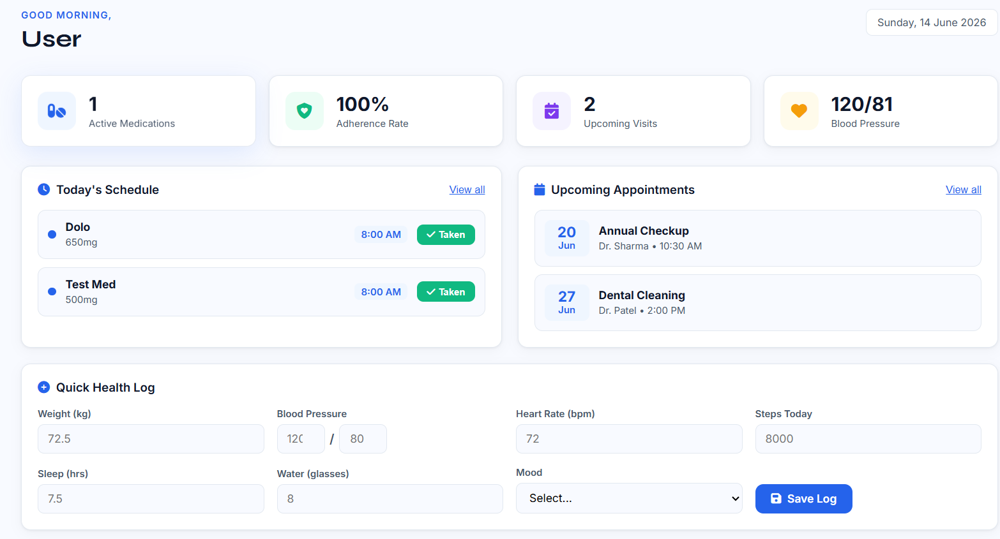
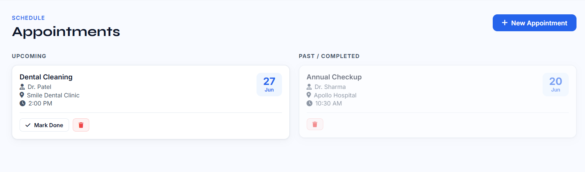
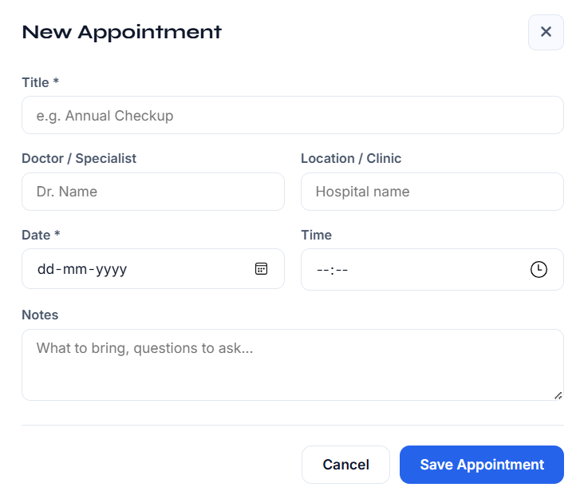
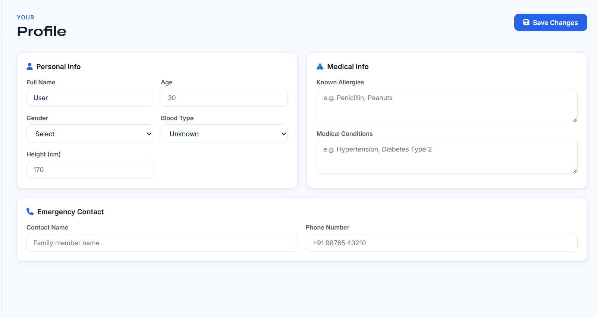

# 🏥 HealthMate — Medicine Reminder & Health Tracking System

A full-stack healthcare management web application for tracking medications, appointments, and personal health vitals.


---

## 📌 About

HealthMate is a personal healthcare management platform that helps users stay on top of their medications, track doctor appointments, and monitor daily health vitals in one place.

### Key Features

- 💊 Medication reminders and tracking
- 📅 Appointment scheduling
- 📈 Health vitals monitoring
- 🔔 Smart notifications
- 👤 User profile management
- 📱 Responsive design

---

## 🛠 Tech Stack

| Layer | Technology |
|---------|----------|
| Frontend | HTML5, CSS3, JavaScript |
| Backend | Python, Flask |
| Database | SQLite |
| Charts | Chart.js |
| Icons | Font Awesome |

---

## 📷 Screenshots

### 🏠 Home Page



### 📊 Dashboard


### 💊 Medication Page


### ➕ Add Medication


### 📅 Appointments



### 🗓 Schedule Appointment



### 👤 User Profile



---

## 🚀 Getting Started

### Prerequisites

- Python 3.10+
- pip

### Installation

```bash
git clone https://github.com/your-username/HealthMate.git
cd HealthMate
```

```bash
pip install -r requirements.txt
```

```bash
python app.py
```

Open:

```
http://localhost:5000
```

---

## 📁 Project Structure

```text
HealthMate/
│
├── app.py
├── requirements.txt
├── README.md
├── index.html
├── style.css
├── app.js
│
├── Dashboard.png
├── HomePage.png
├── MedicationPage.png
├── AddMedication.png
├── Appointment.png
├── ScheduleAppointment.png
└── Profile.png
```

---

## ✨ Features

### 💊 Medication Management

- Add medications
- Set reminder schedules
- Track dosage history
- Monitor missed medications

### 📅 Appointment Tracking

- Schedule appointments
- View upcoming visits
- Track completed appointments

### 📈 Health Monitoring

- Blood pressure tracking
- Weight monitoring
- Heart rate records
- Blood sugar logging
- Sleep tracking
- Water intake tracking

### 🔔 Smart Reminders

- Medication alerts
- Daily schedules
- Notification badges

### 👤 User Profile

- Personal information
- Medical conditions
- Allergies
- Emergency contacts

---

## 👨‍💻 Author

**Jyotiradithya Reddy**  
B.Tech CSE, NIT Delhi

---

⭐ If you found this project useful, consider giving it a star!
