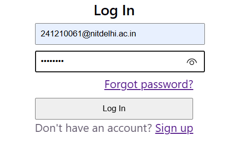
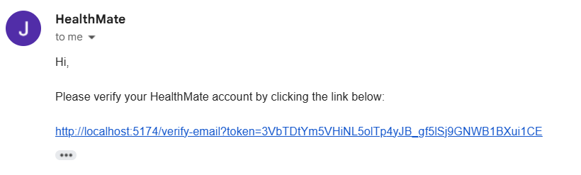
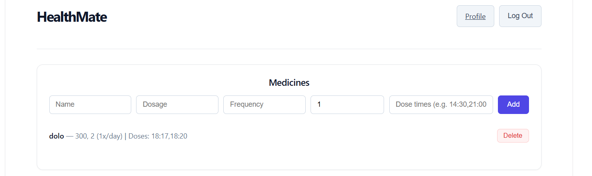
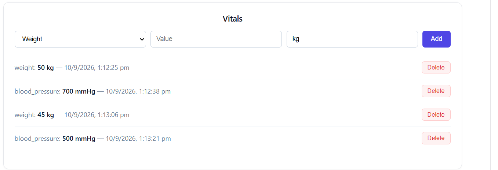
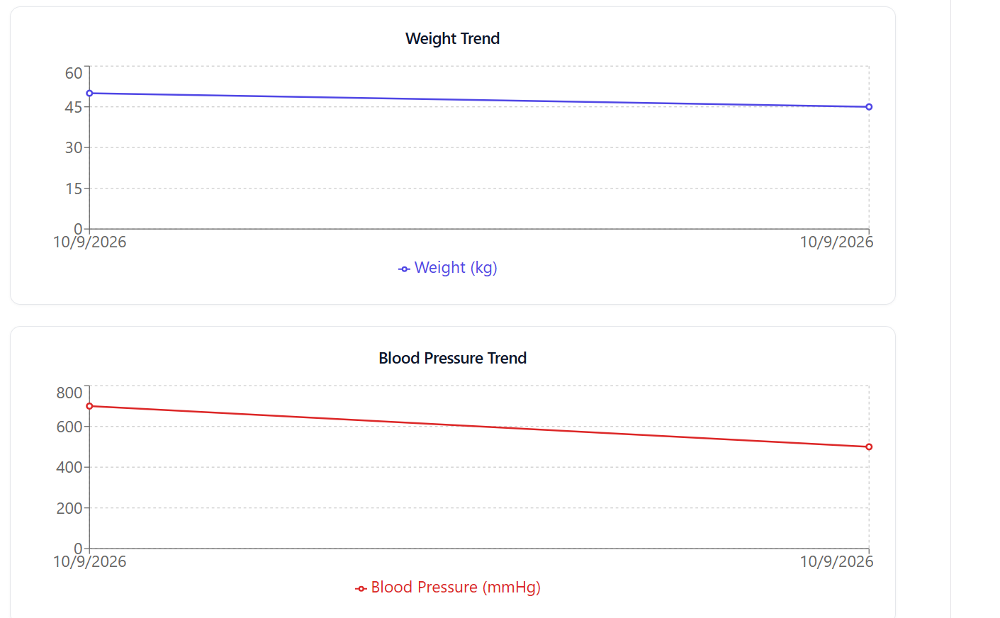
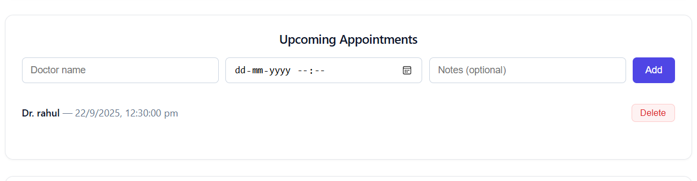
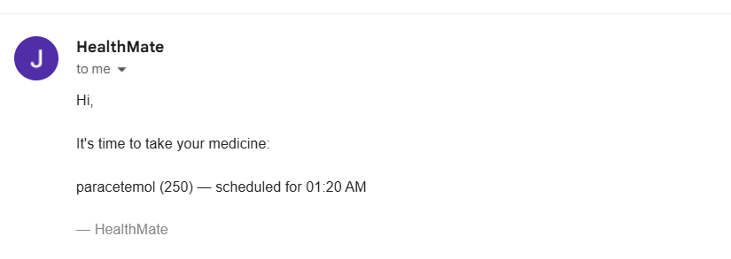

# HealthMate

A full-stack personal health management application — track medications with per-dose reminders, log vitals with trend charts, manage appointments, and keep a history of doctor visits. Built with a complete authentication system including email verification and password recovery.

**Live Demo:** https://healthmate-production-d9b7.up.railway.app
**Backend API Docs:** https://healthmate-production-6fe3.up.railway.app/docs

---

## Features

- **Authentication** — signup with mandatory email verification, JWT-based login, forgot/reset password flow
- **Patient Profile** — personal info (name, age, gender, blood type) and emergency contact details
- **Medicine Tracking** — log medicines with dosage, frequency, and specific dose times (e.g. `09:00,21:00`), with automated per-dose email reminders
- **Vitals Tracking** — log weight, blood pressure, and blood sugar with interactive trend line charts
- **Appointment Management** — schedule upcoming appointments with automated 24-hour-advance email reminders
- **Doctor Visit History** — record past visits with diagnosis, prescription, and notes
- **Full CRUD everywhere** — add and delete medicines, vitals, appointments, and visit records

---

## Screenshots

### Login

### Email Verification

### Dashboard — Medicines

### Dashboard — Vitals

### Vitals Trend Charts

### Dashboard — Appointments

### Dashboard — Doctor Visit History

### Automated Reminder Email

---

## Tech Stack

**Frontend:** React (Vite), React Router, Axios, Recharts
**Backend:** FastAPI, SQLAlchemy, APScheduler
**Database:** MySQL
**Authentication:** JWT (python-jose), bcrypt password hashing
**Email:** Resend (transactional email API)
**Deployment:** Docker + Railway (backend, frontend, and MySQL as separate services)

---

## Architecture

The application runs as three independent, containerized services — mirroring how real production systems are deployed, rather than as a single monolithic app:

- **Frontend** (React, served via Nginx) — a single-page app that talks to the backend exclusively through its REST API
- **Backend** (FastAPI) — handles auth, business logic, and runs the background reminder scheduler
- **Database** (MySQL) — a fully separate service, reached only over the network via SQLAlchemy

Docker containerizes each service independently, so the exact setup that runs locally via `docker-compose` is what's deployed to production on Railway — no gap between development and deployment. Getting this right meant solving a few real container-networking problems: making the backend wait for MySQL to be truly ready (not just started) before connecting, passing frontend environment variables at Docker *build* time rather than runtime (a common Vite + Docker gotcha), and configuring Nginx to fall back to `index.html` so React Router's client-side routes don't 404 on direct navigation.